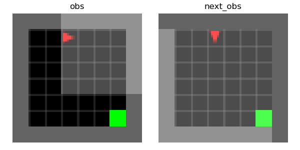

# World Model Setup Guide

## Step 1: Create a folder and navigate to it

Create a folder, then open terminal and navigate to that folder:
```bash
cd "/Users/steph/Desktop/World Model"
```

## Step 2: Create and activate a virtual environment
```bash
python3 -m venv .venv
source .venv/bin/activate
```

You should now see `(.venv)` at the start of the terminal prompt.

## Step 3: Install the required packages
```bash
pip install "gymnasium[classic-control]" minigrid numpy
```

## Step 4: Run the script
```bash
python3 collect_minigrid_data.py
```


## Optional: Visualize a Sample Transition

To better understand the data being collected, visualize observation pairs:
```bash
python3 view_npz_sample.py
```

### Example Output

**Figure 1: MiniGrid transition example**



---

## 📖 Understanding the Visualization

### Layout Overview

The visualization shows two side-by-side images representing consecutive time steps in the environment.

#### **Left image: `obs` (time step t)**
- **Red triangle** (🔺): The agent/robot
  - Its orientation shows the direction it's facing (here: pointing right)
- **Green square** (🟩): The goal tile the agent is trying to reach
- **Dark gray cells**: Walkable floor tiles
- **Light gray border**: Walls/boundaries (impassable)
- **Black region**: Unobserved space (partial observability)

> At time `t`, the agent is in the upper-left corridor with limited visibility. The goal appears in the bottom-right corner of its field of view.

#### **Right image: `next_obs` (time step t + 1)**
- Shows the environment after the agent takes an action
- **Red triangle**: Now pointing down in the top-middle area (agent moved and rotated)
- **Green square**: Goal position unchanged (bottom-right)
- **Black region**: Significantly reduced—the agent's new position provides better visibility of the central area

---

## 🔍 What Each Data Point Represents

Each transition in your dataset contains:
```
"At time t, I saw obs, took action a, and at time t+1, I saw next_obs"
```

Your world model will learn to predict `next_obs` (or its latent representation) given `obs` and `a`.

---

## Color/Object Key

| Visual Element | Meaning |
|----------------|---------|
| 🔺 **Red triangle** | Agent (orientation indicates facing direction) |
| 🟩 **Green square** | Goal tile |
| **Dark gray cells** | Walkable floor tiles |
| **Light gray border** | Walls/boundaries (impassable) |
| **Black region** | Unobserved space (outside agent's field of view) |

---

## Dataset Validation

The visualization confirms that your dataset contains valid environment transitions:
- Each `(obs, action, next_obs)` triplet represents a real agent movement
- Observations reflect the agent's partial view of the world
- Transitions capture state changes as the agent navigates

---
