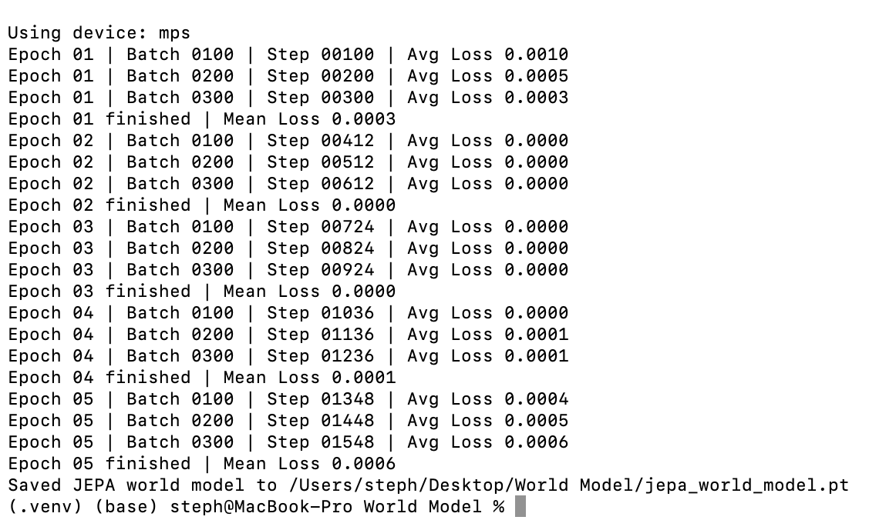
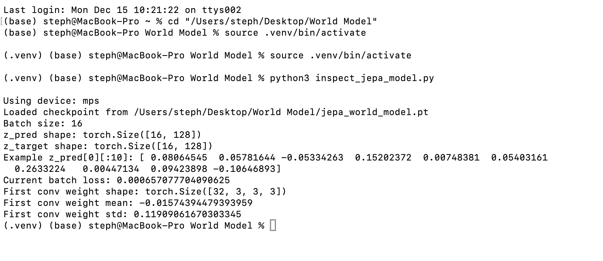

# Part 3 – JEPA-style World Model

This part adds a first **JEPA-style world model** on top of the MiniGrid dataset from Part 1 and the PyTorch DataLoader from Part 2.

## Overview

In Parts 1-2 we built an **offline MiniGrid dataset** of transitions.  
At each time step we stored:

- the current observation image `obs_t`
- the discrete action taken `action_t`
- the next observation image `obs_{t+1}`

In Part 3, we treat this as a **world-model learning problem**:

> Given `(obs_t, action_t)`, learn an internal representation that can
> accurately predict what the world will look like one step later.

Instead of predicting raw pixels, we:

1. **Encode each observation into a latent state** `z_t` using a small CNN.
2. **Learn a latent dynamics model** that takes `(z_t, action_t)` and predicts a
   next latent state `z_{t+1}^{pred}`.
3. **Use a target encoder** (an EMA copy of the online encoder) to produce a
   slowly moving target representation `z_{t+1}^{target}` from `obs_{t+1}`.
4. **Train with a JEPA/BYOL-style loss** that regresses `z_{t+1}^{pred}` onto
   `z_{t+1}^{target}` after L2-normalization.

This gives us a **prediction-only world model** in latent space:

- It never reconstructs pixels.
- It focuses purely on learning a latent state `z_t` that is good for
  **predicting how the world evolves under actions**.
- Later, we can probe these latents for structure (agent position, goal
  location, “room configuration”, etc.) and compare them to
  reconstruction-based world models.


### The Model

- **Encodes observations** into a latent vector `z_t`
- **Uses an action-conditioned latent dynamics model** to predict `z_{t+1}`
- **Uses a target encoder** (EMA copy of the online encoder)
- **Minimizes MSE** between the normalized predicted latent and the target latent

This approach enables:
- Comparison to reconstruction-based models
- Probing for hierarchical structure (agent position, goal, etc.)

### The big picture

There are three main pieces of code behind Part 3:

1. `world_model_jepa.py`: defines the JEPA world model

2. `train_jepa.py`: trains that model on MiniGrid transitions

3. `inspect_jepa_model.py`: loads the checkpoint and peeks inside

All of them sit on top of the data pipeline from Parts 1-2:

Part 1: collect_minigrid_data.py -> saves (obs, action, next_obs, reward, done) into a .npz

Part 2: minigrid_dataset.py -> wraps that .npz as a PyTorch Dataset + DataLoader

The JEPA part then says: "Given (obs_t, action_t, obs_{t+1}), can I learn a latent representation z_t and a dynamics function that predicts z_{t+1}?"


---

## Installation & Setup

### 1. Navigate to your project folder
```bash
cd "/Users/steph/Desktop/World Model"
```

### 2. Activate your virtual environment
```bash
source .venv/bin/activate
```

You should see `(.venv)` at the start of your terminal prompt.

### 3. Install dependencies (if needed)

If you already completed Parts 1 and 2, these should already be installed. Otherwise:
```bash
pip install torch gymnasium[minigrid] minigrid numpy
```

> **Note for zsh users:** Use quotes around `"gymnasium[classic-control]"` to avoid glob pattern issues.

---

## Running the Training Script

### 4. Run the JEPA training script
```bash
python3 train_jepa.py
```

### Expected Output
```
Using device: mps
Epoch 01 | Batch 0100 | Step 00100 | Avg Loss 0.0010
Epoch 01 | Batch 0200 | Step 00200 | Avg Loss 0.0005
Epoch 01 | Batch 0300 | Step 00300 | Avg Loss 0.0003
Epoch 01 finished | Mean Loss 0.0003
Epoch 02 | Batch 0100 | Step 00412 | Avg Loss 0.0000
Epoch 02 | Batch 0200 | Step 00512 | Avg Loss 0.0000
Epoch 02 | Batch 0300 | Step 00612 | Avg Loss 0.0000
Epoch 02 finished | Mean Loss 0.0000
Epoch 03 | Batch 0100 | Step 00724 | Avg Loss 0.0000
Epoch 03 | Batch 0200 | Step 00824 | Avg Loss 0.0000
Epoch 03 | Batch 0300 | Step 00924 | Avg Loss 0.0000
Epoch 03 finished | Mean Loss 0.0000
Epoch 04 | Batch 0100 | Step 01036 | Avg Loss 0.0000
Epoch 04 | Batch 0200 | Step 01136 | Avg Loss 0.0001
Epoch 04 | Batch 0300 | Step 01236 | Avg Loss 0.0001
Epoch 04 finished | Mean Loss 0.0001
```



### Model Checkpoint

At the end of training, the learned weights are saved as:
```
jepa_world_model.pt
```

in the same folder as `train_jepa.py`.

## Inspecting the learned world model

To get a feel for what the trained JEPA model is doing, you can run
`inspect_jepa_model.py`, which:

- loads `jepa_world_model.pt`
- pulls a small batch from the MiniGrid dataset
- runs a forward pass to get `z_pred` and `z_target`
- prints basic stats about the first conv layer weights

```bash
cd "/Users/steph/Desktop/World Model"
source .venv/bin/activate
python3 inspect_jepa_model.py
```




This confirms that the checkpoint loads correctly, each observation is mapped to a 128-D latent vector, the predicted and target latents match closely (small loss), and the first conv layer weights is well-behaved.
